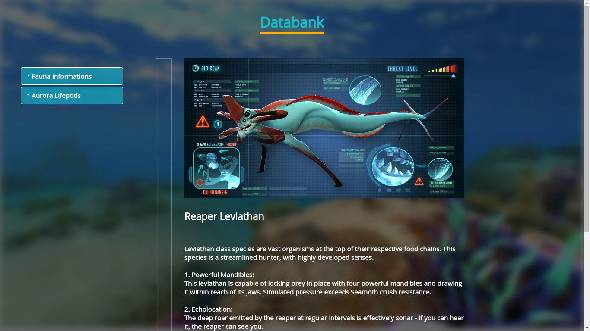
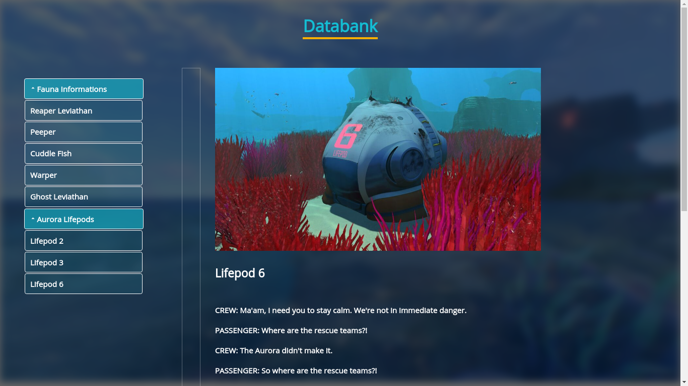
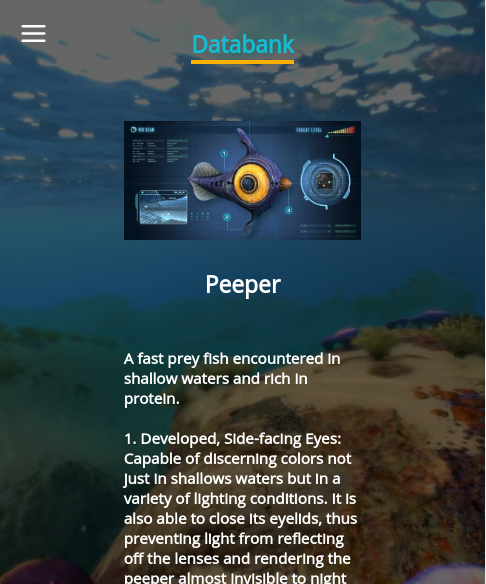

# subnautica-pda
Subnautica pda databank on web, made with react for learning purposes, again.

## Screenshots





---

## 💾 Installing 

Git clone the repository

```
git clone https://github.com/str4vinsk/web-subnautica-databank
```

Install the dependencies

```
yarn install
```

And run it!

```
yarn start
```

---

## 💻 Technologies

- [ReactJs] (https://reactjs.org)

---

## ⚛️ React Dependencies
 
 - [Styled Components] (https://styled-components.com)
 - [React Icons] (https://react-icons.github.io/react-icons/)

---

## 📖 Author
<table>
  <tr>
    <td  align=center>
        
        <a href="https://github.com/str4vinsk">
          <br>
            Vitor Conroy
          </br>
        </a>
        <sub>
          <a href="https://www.instagram.com/vitorconroy/" alt="instagram">
            ☕️ @vitorconroy
          </a>
        </sub>
    </td>
  </tr>
</table>
